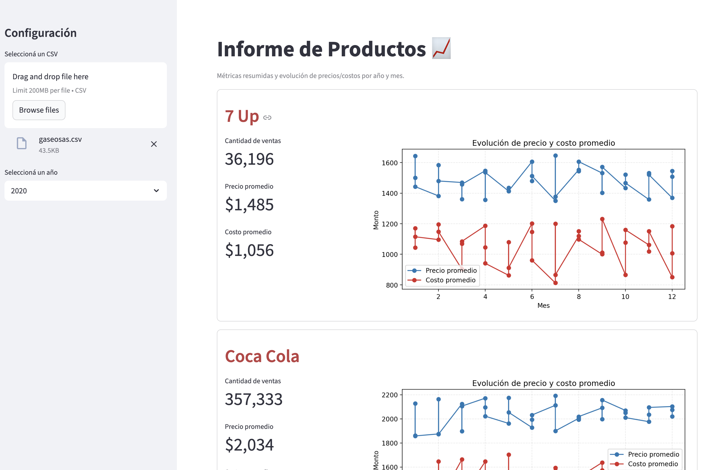

# TP5 - Análisis de Datos con Streamlit

## Objetivo

Desarrollar una aplicación web interactiva utilizando **Streamlit** que permita visualizar y analizar datos de productos a partir de archivos CSV. La aplicación debe generar informes con métricas y gráficos de evolución de precios y costos.

## Descripción

Deberás crear una aplicación que cumpla **exactamente** con las siguientes especificaciones:

### Funcionalidades Requeridas

#### 1. Configuración de la Página
- La aplicación debe configurarse con el título "Reporte de productos" y diseño ancho (`layout="wide"`)

#### 2. Barra Lateral (Sidebar)
La barra lateral debe contener:
- Un título "Configuración"
- Un selector de archivos (`file_uploader`) que:
  - Muestre el texto "Seleccioná un CSV"
  - Acepte únicamente archivos con extensión `.csv`
- Un selector desplegable (`selectbox`) para elegir el año, que:
  - Muestre los años disponibles ordenados
  - Tenga el texto "Seleccioná un año"

#### 3. Validaciones
- Si no se ha cargado ningún archivo:
  - Mostrar mensaje informativo: "Subí un archivo CSV desde la barra lateral para comenzar."
  - Detener la ejecución
- Si el año seleccionado no tiene datos:
  - Mostrar mensaje de advertencia: "El año seleccionado no tiene datos para mostrar."
  - Detener la ejecución

#### 4. Encabezado Principal
- Título: "Informe de Productos 📈"
- Subtítulo (caption): "Métricas resumidas y evolución de precios/costos por año y mes."

#### 5. Visualización por Producto
Para cada producto en el dataset (ordenados alfabéticamente), crear un contenedor con borde que incluya:

##### a) Título del Producto
- Formato: `## :red[{nombre_del_producto}]`

##### b) Columnas de Información
Dividir el contenedor en dos columnas con proporción 0.3 y 0.7:

**Columna de Métricas (izquierda, 30%):**
- Cantidad de ventas (suma total con formato de miles separados por comas)
- Precio promedio (con 2 decimales)
- Costo promedio (con 2 decimales)

**Columna de Gráfico (derecha, 70%):**
- Gráfico de líneas que muestre:
  - Evolución mensual del precio promedio (línea azul `#1f77b4`, con marcadores circulares)
  - Evolución mensual del costo promedio (línea roja `#d62728`, con marcadores circulares)
  - Eje X: Mes
  - Eje Y: Monto
  - Título del gráfico: "Evolución de precio y costo promedio"
  - Leyenda posicionada en el mejor lugar
  - Grilla con líneas punteadas y transparencia del 30%
  - Tamaño de figura: 8x3

#### 6. Cálculos Requeridos
Para cada producto, calcular:
- **Precio promedio**: `ingreso / cantidad`
- **Costo promedio**: `costo / cantidad`

## Estructura del CSV

El archivo CSV debe contener las siguientes columnas:
- `año`: Año de la venta
- `mes`: Mes de la venta
- `producto`: Nombre del producto
- `cantidad`: Cantidad vendida
- `ingreso`: Ingreso total por las ventas
- `costo`: Costo total de los productos vendidos

## Tecnologías a Utilizar

- **Python 3.x**
- **Streamlit**: Framework para la aplicación web
- **Pandas**: Manipulación y análisis de datos
- **Matplotlib**: Generación de gráficos

## Criterios de Evaluación
- ✅ Funcionalidad completa según especificaciones
- ✅ Carga y validación correcta de archivos CSV
- ✅ Filtrado por año funcionando correctamente
- ✅ Cálculos de métricas precisos
- ✅ Visualizaciones con formato y colores especificados
- ✅ Organización y presentación de la información
- ✅ Manejo de casos especiales (sin archivo, sin datos)

## Imagen de Referencia

El sistema se debe parecerse a la siguiente imagen:

<!-- Alternativa para controlar tamaño (descomentar si se prefiere):

-->

> **Nota 1**: Revisar que los valores sean exactos a los mostrados en la imagen
> **Nota 2**: Debe funcionar con `gaseosas.csv` o para cualquier `csv` con la misma estructura
---
## Entrega
**Fecha de entrega**: Lunes 20 de octubre a las 23:59 hs.
Subir solo el archivo `ejercicio.py` como **TP5 - {legajo} - {apellido} {nombre}** a GitHub