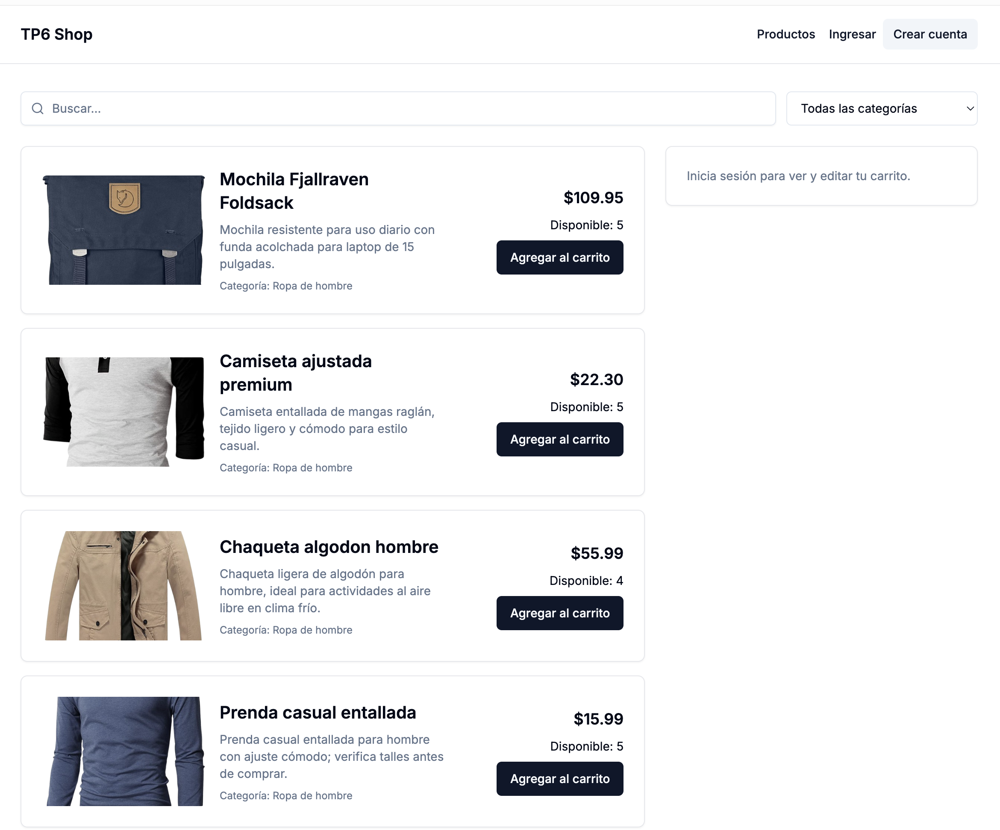
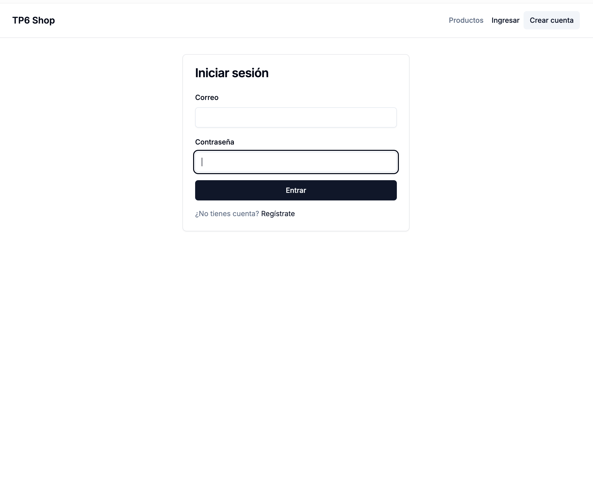
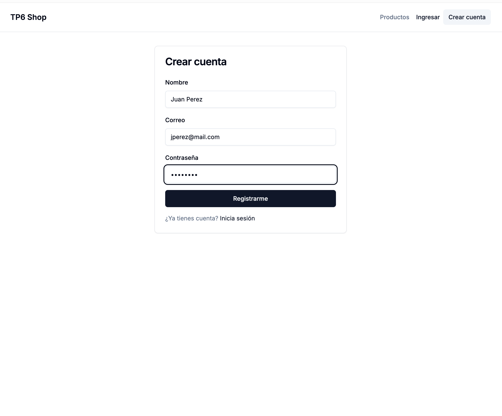
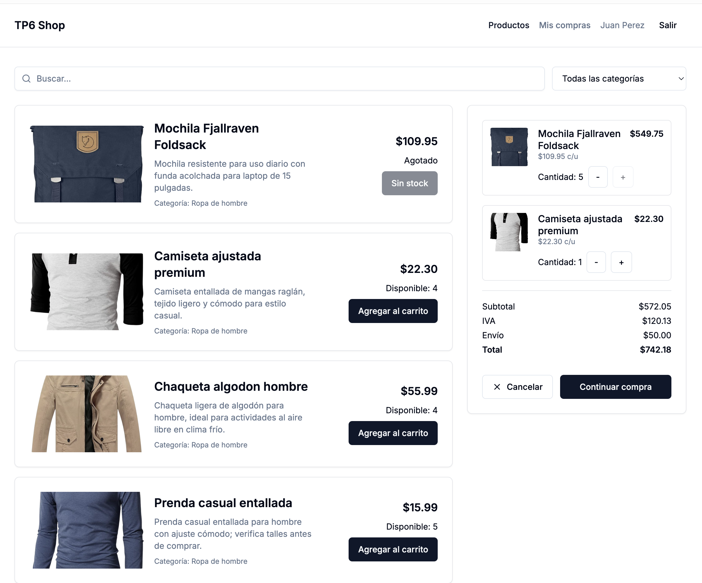
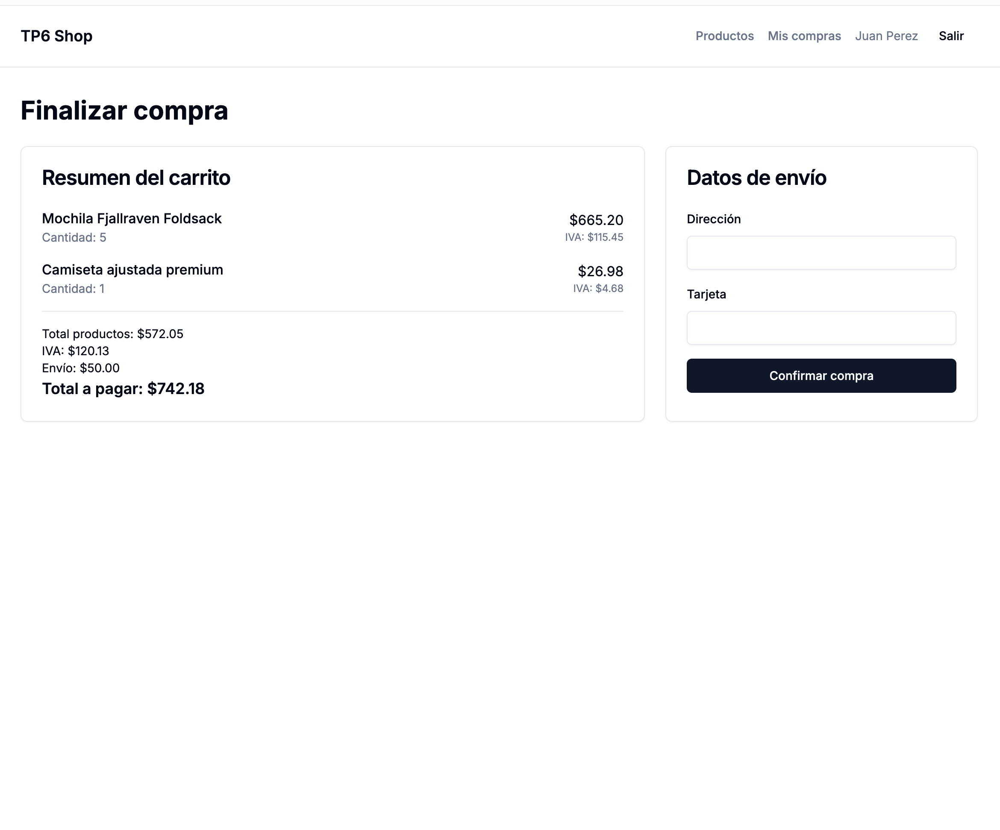
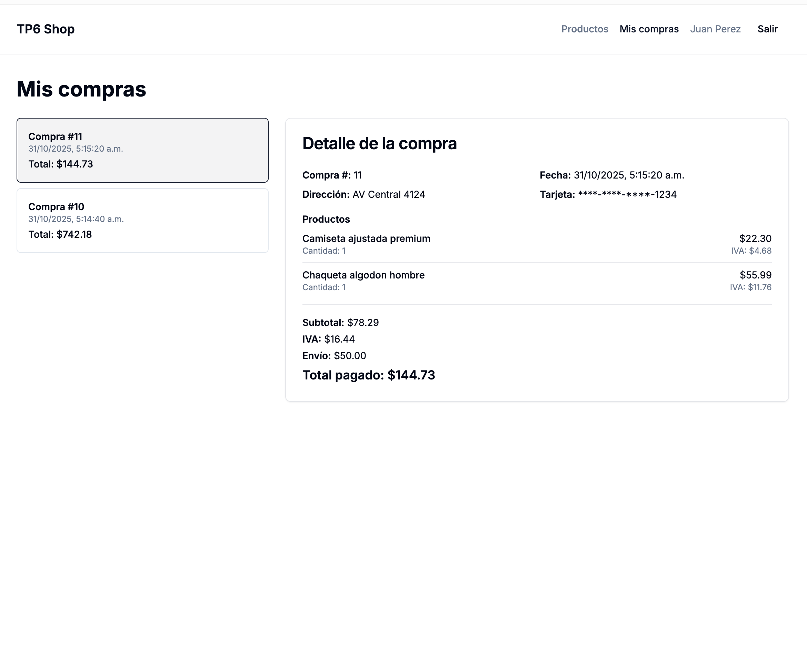

# TP6: 2do Parcial

El trabajo práctico 2 será evaluado como el 2do parcial.
El trabajo es individual y debe ser realizado en el repositorio personal de cada alumno.

Debe ser entregado el día *Miércoles 12 de Noviembre a partir de las 21hs y hasta las 22hs*.


## Objetivo

Desarrollo de un sitio de comercio electrónico simple utilizando usando React para el frontend y FastAPI para el backend.

## Funcionalidad
- Registar usuario
- Iniciar sesión
- Cerrar sesión
- Ver resumen de compras
- Ver detalle de compras
- Buscar productos (por contenido y categoría)
- Agregar productos al carrito
- Quitar productos del carrito
- Cancelar compra
- Finalizar compra

## Tecnologías
- Frontend: React (Usando next.js con Tailwind CSS & Shadcn UI)
- Backend: FastAPI (API RESTful, SQLModel + SQLite)

## Cómo ejecutar (PowerShell)

A continuación hay comandos mínimos para levantar el proyecto en Windows PowerShell desde la raíz del repositorio.

- Levantar el backend (usar el virtualenv del backend si está disponible):

```powershell
cd tp\61033 - Quiroga, José María\tp6\backend
# activar virtualenv si corresponde (ejemplo):
# .\.venv\Scripts\Activate.ps1
python -m uvicorn main:app --reload --host 127.0.0.1 --port 8000
```

- Levantar el frontend en modo desarrollo (Next.js):

```powershell
cd tp\61033 - Quiroga, José María\tp6\next-app
npm install
npm run dev
# por defecto Next arranca en http://localhost:3000
```

- Comandos útiles para producción / compilado (desde `next-app`):

```powershell
npm ci
npm run build
npm run start
```

Nota: si no querés o no podés compilar el frontend en producción, podés usar el servidor de desarrollo (`npm run dev`) para la presentación local.

## Scripts y utilidades

- `backend/scripts/seed_db.py`: script para recrear y poblar la base de datos de ejemplo.
- `docker-compose.yml`, `backend/Dockerfile` y `next-app/Dockerfile`: archivos para levantar la aplicación con Docker (opcional).


## Estructura de la base de datos
    - Usuario: id, nombre, email, contraseña (hashed)
    - Producto: id, nombre, descripción, precio, categoría, existencia
    - Carrito: id, usuario_id, estado, productos (lista de productos con cantidad)
        - Item del carrito: producto_id, cantidad
    - Compra: id, usuario_id, fecha, direccion, tarjeta, total, envio  
        - Item de compra: producto_id, cantidad, nombre, precio_unitario

## Endpoints de la API
- POST /registrar: Registrar un nuevo usuario
- POST /iniciar-sesion: Iniciar sesión y obtener token de autenticación
- POST /cerrar-sesion: Cerrar sesión (invalidar token)
- GET /productos: Obtener lista de productos (con filtros opcionales por categoría y búsqueda)
- GET /productos/{id}: Obtener detalles de un producto específico
- POST /carrito: Agregar producto al carrito
- DELETE /carrito/{product_id}: Quitar producto del carrito
- GET /carrito: Ver contenido del carrito
- POST /carrito/finalizar: Finalizar compra
- POST /carrito/cancelar: Cancelar compra (vaciar carrito)
- GET /compras: Ver resumen de compras del usuario
- GET /compras/{id}: Ver detalle de una compra específica

## Pantallas principales
- Pantalla de registro e inicio de sesión
- Pantalla de listado de productos con búsqueda y filtros / Carrito de compras
- Pantalla de finalización de compra (carrito + con dirección y detalles de pago)
- Pantalla de compras anteriores (resumen + detalle)

## Flujo de trabajo
1. El usuario se registra e inicia sesión.
2. El usuario navega por los productos, utilizando búsqueda y filtro de categoría.
3. El usuario agrega productos al carrito.
4. El usuario revisa el carrito y puede eliminar productos si lo desea.
5. El usuario finaliza la compra proporcionando dirección y detalles de pago.
6. El usuario puede ver un resumen de sus compras anteriores.

## Reglas de uso
- Solo se puede agregar productos al carrito si hay existencia disponible.
- El usuario debe estar autenticado para realizar compras y ver su historial.
- El precio total se calcula sumando el precio unitario por la cantidad de cada producto en el carrito.
- El iva es el 21% del total de la compra (excepto los productos electrónicos que son 10%).
- El envío es gratuito para compras superiores a $1000, de lo contrario tiene un costo fijo de $50.
- Los productos solo pueder ser eliminados del carrito si el carrito no ha sido finalizado.
- Una vez finalizada la compra, el carrito se vacía y se crea un registro de compra.
- Los productos sin existencias deben mostrarse como "Agotados" y no se pueden agregar al carrito.

## Consideraciones adicionales
- Realizar pruebas unitarias para los endpoints de la API.
- Implementar manejo de errores adecuado (e.g., usuario no encontrado, producto agotado).
- Cargar datos iniciales de productos en la base de datos para pruebas.
- Los datos de los productos se encuentran en el archivo `productos.json`, las imágenes en la carpeta `/imagenes`.

## Nota importante sobre el build de producción del frontend

Durante la verificación final se detectaron dos problemas que pueden hacer que `npm run build` (Next/Turbopack) falle en entornos distintos al desarrollo local:

1) Bloqueo de archivo nativo SWC (EPERM)
   - Mensaje típico: "EPERM: operation not permitted, unlink ... next-swc.win32-x64-msvc.node".
   - Causa habitual: el binario nativo de SWC está siendo usado por otro proceso (por ejemplo, un servidor Next en ejecución, un editor o un proceso Node en segundo plano) y Windows impide reemplazarlo.
   - Solución/Workaround:
    - Asegurate de cerrar servidores Next/Node en ejecución y cerrar editores que puedan estar usando módulos (VS Code con extensiones que ejecuten procesos Node). Si persiste, reiniciar Windows libera los locks.

2) PostCSS / Tailwind y Turbopack (plugin requerido)
   - Mensaje típico: "It looks like you're trying to use `tailwindcss` directly as a PostCSS plugin... install `@tailwindcss/postcss` and update PostCSS config.".
   - Causa: versiones recientes de Next/Turbopack esperan que Tailwind se use mediante el plugin `@tailwindcss/postcss` en `postcss.config.cjs` en lugar de pasar `tailwindcss` directo cuando PostCSS es evaluado por Turbopack.
   - Solución/Workaround:
    - Instalar el plugin en `next-app`:

```powershell
cd tp\61033 - Quiroga, José María\tp6\next-app
npm install --save-dev @tailwindcss/postcss
```

    - Actualizar `postcss.config.cjs` para usar `require('@tailwindcss/postcss')` en lugar de `require('tailwindcss')` como plugin PostCSS cuando corresponda.

Si necesitás, puedo aplicar estos cambios y reintentar el `npm run build` para dejar el repo listo para CI/producción. Para la entrega inmediata, está bien hacer push ahora y presentar desde tu máquina: el frontend en modo desarrollo funciona correctamente y el backend pasó los tests.


## Instrucciones para la entrega.
> [!NOTA] El trabajo debe ser entregado el día *Miércoles 12 de Noviembre a partir de las 21hs y hasta las 22hs*.
Durante el desarrollo se deben hacer commits frecuentes y descriptivos. (mínimo 10 commits)

## Pantallas.

### Video de demostracion

### 1. Pantalla inicial de productos.


### 2. Pantalla de inicio de sesión.


### 3. Pantalla de registrar usuario.


### 4. Pantalla de compra (con carrito).


### 5. Pantalla de confirmar compra.


### 6. Pantalla de historial de compras.


