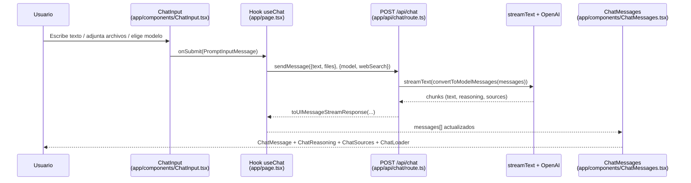

# Arquitectura de la aplicación “IA Chat”

Este documento describe los componentes clave, el flujo de datos y las decisiones técnicas que estructuran la aplicación de chat conversacional ubicada en `clases/ia/ia-chat`.

---

## 1. Visión general

- **Stack**: Next.js 16 (App Router) con React 19 y TypeScript. El runtime es híbrido: componentes de UI en el cliente y `app/api/chat` como ruta serverless.
- **SDK de IA**: `@ai-sdk/react` gestiona el estado del chat (`useChat`) y la comunicación con `@ai-sdk/openai` mediante `streamText`.
- **UI**: combinación de primitives propias (`components/ai-elements`) y componentes derivados de shadcn (`components/ui`), estilizados con Tailwind 4.
- **Objetivo**: ofrecer un chat modular capaz de mostrar mensajes, razonamiento y fuentes en streaming, con selección de modelo y toggle de búsqueda web.

---

## 2. Capas y carpetas principales

### App Router (`/app`)
- `app/layout.tsx`: define fuentes (Geist), estilos globales y metadata base.
- `app/page.tsx`: punto de entrada client-side; instancia `useChat`, maneja el estado local (input, modelo, búsqueda web) y orquesta los componentes de presentación (`ChatContainer`, `ChatMessages`, `ChatInput`, etc.).
- `app/globals.css`: habilita Tailwind 4, tokens CSS personalizados y variantes (`dark`) compartidas por todo el árbol de React.

### Capa de API (`app/api/chat/route.ts`)
- Expone el endpoint `POST /api/chat`, recibe `messages`, `model` y `webSearch`.
- Selecciona el modelo final (`webSearch` fuerza `openai/gpt-4o`), convierte mensajes con `convertToModelMessages` y abre un stream vía `streamText`.
- Devuelve respuestas incrementalmente con `result.toUIMessageStreamResponse({ sendSources, sendReasoning })`, habilitando razonamiento y fuentes cuando el modelo lo soporta.

### Componentes de dominio (`app/components`)
- `ChatContainer`, `ChatMessages`, `ChatMessage`, `ChatReasoning`, `ChatSources`, `ChatInput`, `ChatLoader`: encapsulan layout, scroll, renderizado de partes, inputs y estados de carga.
- `types.ts`: contratos compartidos (`MessagePart`, `ChatStatus`, `Model`).
- Esta capa sólo depende de primitives declarativas ubicadas en `components/ai-elements`, manteniendo el árbol de componentes del `page.tsx` limpio y declarativo.

### Diseño de componentes (`components/ai-elements` y `components/ui`)
- `components/ai-elements`: set de primitives reutilizables (conversation, message, prompt-input, reasoning, sources, loader, etc.) inspiradas en las plantillas de Vercel AI SDK. Manejan patrones complejos como menús de adjuntos, toolbars, chips de fuentes y layouts responsivos.
- `components/ui`: colección shadcn/ui (botones, selects, cards, etc.) que respeta el mismo sistema de tokens definido en `globals.css`.

### Utilidades compartidas (`/lib`)
- `lib/utils.ts`: helpers como `cn` (combinación de clases con `clsx` + `tailwind-merge`), usados transversalmente por primitives.

---

## 3. Flujo de datos extremo a extremo

### Detalles clave
1. **Validación mínima en el cliente** (`handleSubmit` en `app/page.tsx:30-53`): evita enviar requests vacíos.
2. **Estado centralizado**: `useChat` suministra `messages`, `status`, `sendMessage` y `regenerate`, eliminando la necesidad de un contexto propio.
3. **Streaming**: `status === 'streaming'` o `'submitted'` determina cuándo mostrar `ChatReasoning` en modo animado y `ChatLoader`.
4. **Fuentes condicionadas**: `sendSources` sólo es verdadero para modelos OpenAI, lo que evita renderizados vacíos en `ChatSources`.

---

## 4. Presentación y renderizado de mensajes

- `ChatMessages` envuelve el feed dentro de `<Conversation>` (scroll stick-to-bottom + botón de “volver al final”).
- Cada `UIMessage` se normaliza en `app/page.tsx`:
  - Si el backend envía `parts`, se respetan; de lo contrario se crea una parte `text`.
  - Se detectan `source-url` para poblar `ChatSources`.
  - `ChatReasoning` se renderiza cuando existe un `part.type === 'reasoning'`.
- `ChatMessage` muestra acciones contextualizadas (retry/copy) sólo para la última respuesta del asistente.
- `ChatLoader` se activa cuando `status === 'submitted'`, anticipando la primera respuesta del modelo.

---

## 5. Entrada de usuario y configuración dinámica

- `ChatInput` (basado en `PromptInput` de `components/ai-elements/prompt-input.tsx`) divide la UI en `Header` (attachments), `Body` (textarea) y `Footer` (herramientas).
- Características soportadas:
  - Adjuntar múltiples archivos (drag & drop global).
  - Menu contextual para añadir adjuntos adicionales.
  - Selector de modelo (`availableModels` definido en `app/page.tsx`).
  - Botón `Search` que conmuta `webSearch`, modificando la lógica del backend.
  - `PromptInputSubmit` deshabilita el envío cuando no hay texto ni archivos.

---

## 6. Estilos, iconografía y accesibilidad

- **Tailwind 4**: se importa en `app/globals.css` con `@import "tailwindcss";`; el archivo define los tokens base (background, foreground, semantic colors) y variantes `dark`.
- **Radix + Lucide + motion**: usados por los primitives (`PromptInput`, menús, acciones) para accesibilidad y animaciones out-of-the-box.
- **Responsive**: el layout principal (`ChatContainer`) fija `max-w-4xl` y adapta la altura con `h-screen`, permitiendo que `ChatMessages` tome el espacio restante.

---

## 7. Extensibilidad y puntos de personalización

| Área | Cómo extenderla |
| --- | --- |
| Nuevos modelos | Añadir entradas al array `models` en `app/page.tsx` y adaptar `app/api/chat/route.ts` si el proveedor no es OpenAI. |
| Nuevos tipos de partes | Extender `MessagePart.type` en `app/components/types.ts` y añadir un `case` en el render loop de `app/page.tsx`. |
| Nuevas herramientas de entrada | Reutilizar `PromptInputActionMenu` o `PromptInputButton` dentro del `Footer` de `ChatInput`. |
| Temas visuales | Actualizar tokens en `app/globals.css` o incorporar CSS variables adicionales para componentes específicos. |
| Integraciones externas | Utilizar `sendMessage` con `body` enriquecido (p. ej. parámetros propios) y leerlos en `app/api/chat/route.ts`. |

---

Con esta arquitectura modular, la aplicación mantiene una clara separación entre capa visual, lógica de conversación y capa de IA. Cada bloque es intercambiable, lo que facilita iterar sobre nuevas capacidades de asistentes, experimentar con proveedores de modelos y ajustar la experiencia de usuario sin generar deuda técnica.
