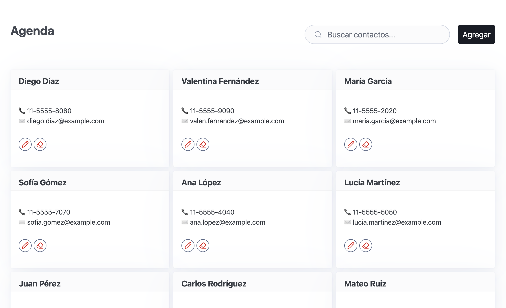

# TP2: Agenda de contactos (Web)

## Objetivo

Desarrollar una "Agenda de contactos" como aplicación web usando JavaScript puro y Pico.css para la presentación.

## Fecha de entrega

> [!IMPORTANT]
> El trabajo debe presentarse hasta el **Lunes 8 de septiembre a la 21hs**.

## Alcance y lineamientos

- Implementación sin frameworks: solo **HTML**, **CSS (Pico.css)** y **JavaScript**.
- La interfaz debe ser accesible.
- Evitar dependencias externas (salvo Pico.css por CDN).
- Mantener una estructura simple: un archivo HTML, un JS y un CSS.

## Estructura de datos y modelo

- Implementar dos clases: **Contacto** y **Agenda**.
- Un **Contacto** contiene: `id`, `nombre`, `apellido`, `telefono`, `email`.
- La **Agenda** es una colección de `Contacto` y administra las operaciones.

## Requisitos funcionales

1. Cabecera con:
   - Campo de **búsqueda** (filtra por nombre, apellido, teléfono o email).
   - Botón **Agregar** para abrir un diálogo de alta.
2. Cuerpo con listado de **tarjetas** (cards) de contactos:
   - Muestra todos los contactos o solo los que coinciden con el texto buscado.
   - En cada tarjeta, el **nombre y apellido** deben destacarse.
   - Cada tarjeta debe incluir **dos iconos**: **Editar** y **Borrar**.
3. Agregar contacto:
   - Al presionar "Agregar", se abre un **diálogo** con un formulario para cargar datos.
4. Editar contacto:
   - Al presionar el icono de **Editar**, se abre el mismo diálogo con los datos precargados.
5. Borrar contacto:
   - Al presionar el icono de **Borrar**, se elimina **directamente** el contacto (sin confirmación).
6. Datos iniciales:
   - Al cargar por primera vez, la aplicación debe mostrar **10 contactos de ejemplo**.

## Requisitos técnicos

- JS en **módulo único** o IIFE, sin dependencias.
- Uso de **Pico.css** por CDN para estilos base.
- El render del listado debe ser **dinámico** a partir de los datos actuales.
- La búsqueda debe ser **insensible a mayúsculas y acentos** (normalización de texto).
- Ordenamiento por **apellido** y luego **nombre**.
- Sin persistencia: los datos viven solo en memoria.
- El modelo y la lógica de negocio deben implementarse usando **clases** (`Agenda` y `Contacto`), con métodos para `agregar`, `actualizar` y `borrar`.

## Criterios de aceptación

- La UI incluye: buscador, botón Agregar, listado de tarjetas y diálogo de alta/edición.
- Las tarjetas muestran nombre/apellido destacado y los datos de contacto (teléfono y email).
- Los iconos de Editar/Borrar funcionan y el borrado no pide confirmación.
- La búsqueda filtra en tiempo real, sin recargar la página.
- No hay persistencia: al recargar la página, vuelven a aparecer los 10 contactos de ejemplo.
- El código está organizado, legible y con nombres descriptivos.

## Pistas y consideraciones

- Usar un **array** en memoria para trabajar y sincronizarlo con `localStorage`.
- Normalizar texto para el filtro con `String.prototype.normalize('NFD')` y remover diacríticos.
- Para el diálogo, puede usarse `<dialog>` nativo de HTML.
- Para ordenar, usar `localeCompare` sobre los campos normalizados.

## Entregables

- `./tp2/ejercicio.html`: página principal de la aplicación.
- `./tp2/ejercicio.js`: lógica de la aplicación.
- `./tp2/ejercicio.css`: estilos propios adicionales.

## Cómo ejecutar

- Abrir el archivo `./tp2/ejercicio.html` en un navegador moderno.
- Opcionalmente, levantar un servidor HTTP local simple.

## Como se verá la aplicación
#### Lista de contactos

#### Diálogo de contacto (alta/edición)

## Cómo presentar el trabajo
1. Volver a `main` y actualizar el repo local (fetch/pull).
2. Actualizar el repositorio  (fetch/pull).
3. Crear una rama (TP2-{Legajo}).
4. Implementar la solución en la carpeta correspondiente (`enunciados/tp2/`).
5. Confirmar los cambios realizados (commit).
6. Publicar los cambios en GitHub (push).
7. Realizar el pull request hacia `main` con el título: `TP2 - {Legajo} - {Nombre Apellido}`.
